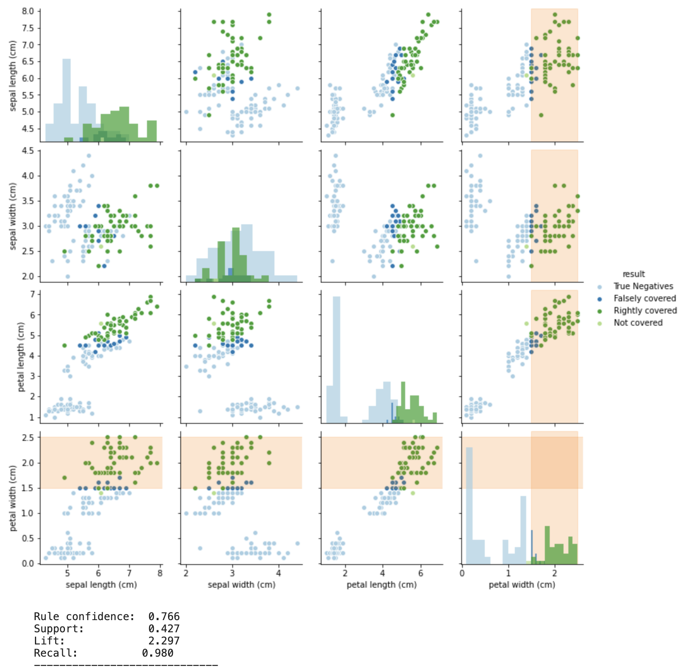
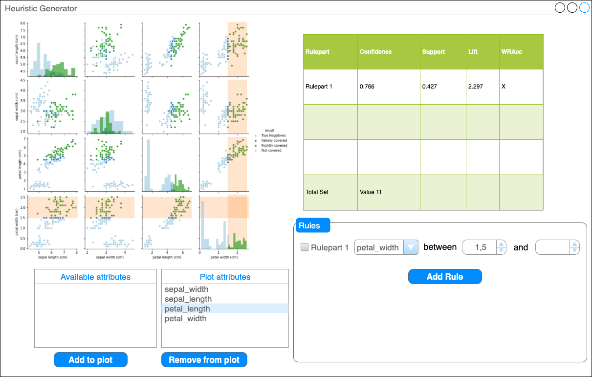
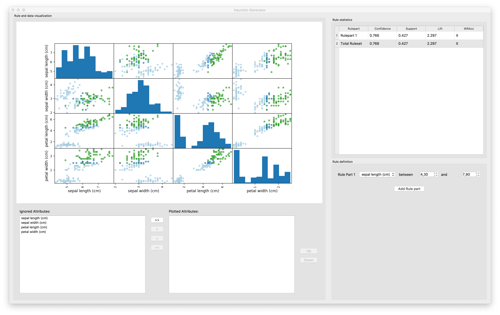

# heuristica

A simple tool to manually develop heuristics based on a user defined rule set for a binary classification dataset. As of now there's only an code example which applies one specific rule on a given binary classification problem and visualize the results in a scatter matrix (as shown in the screenshot below). There is also an user interface which is basically a stub and not working as of now.



Current State:

- Definition and application of multiple used defined rules
- Development of a graphical user interface for defining rules and visualizing the results (based on PySide2, maybe later HTML)
- UI stub as seen below, integration of update mechanisms pending

The Future plans are:

- Different means for result evaluation
  - Integration of different rule metrics
  - Interactive selection of scatter attributes
- Rule suggestion mechanism
- Different rule concatenations

Mockup of the planned UI:



Current state of the UI stub:



## Installation

Create the python environment using:

```shell
conda env create -f environment.yml
```

Activate Environment:

```shell
conda activate heuristica
```

Run Notebook-Server and open the notebook :

```shell
jupyter lab notebook/Rule_Scatter.ipynb
```

The UI stub can be started by the following commands:

```shell
cd src
python app.py
```


