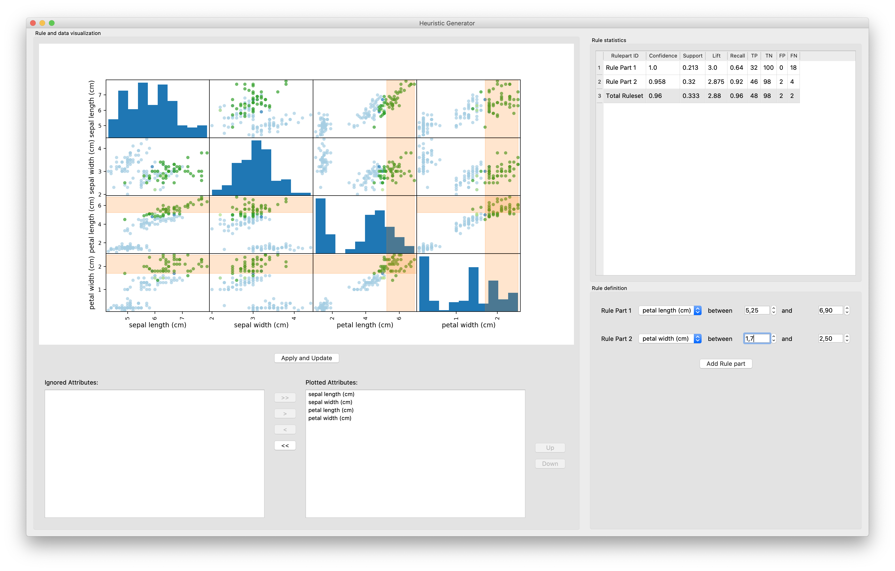

# heuristica

A simple tool to manually develop heuristics based on a user defined rule set for a binary classification dataset. As of now you can apply different user-defined rules on a given binary classification problem and visualize the results in a scatter matrix (as shown in the screenshot below). There is also an user interface which works for the currently integrated iris dataset. This can be changed easily in the code as of and will be configurable via UI or config file soon.



#### Current State:

- Definition and application of multiple used defined rules
- Development of a graphical user interface for defining rules and visualizing the results (based on PySide2, maybe later HTML)
- UI stub as seen below, integration of update mechanisms pending
- Different means for result evaluation
  - Integration of different rule metrics
  - Interactive selection of scatter attributes

#### The Future plans are:

- Rule deletion
- Extended visualization options
- Data Description Panel
- Rule suggestion mechanism
- Different rule concatenations (AND, OR)


## Installation

Create the python environment using:

```shell
conda env create -f environment.yml
```

Activate Environment:

```shell
conda activate heuristica
```

The UI can be started by the following commands:

```shell
cd src
python app.py
```
---

The Example-Notebook focuses on the rule application and can be run with :

```shell
jupyter lab notebook/Rule_Scatter.ipynb
```

